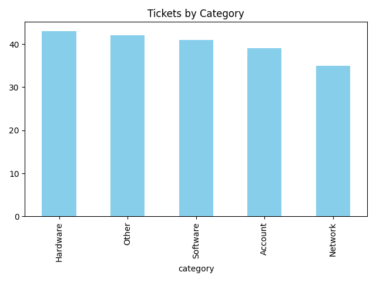
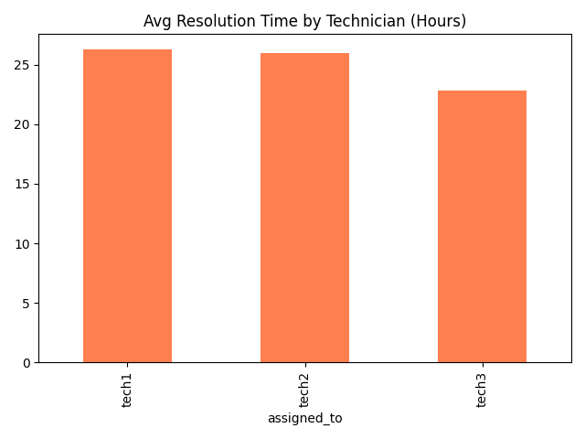

# 📈 Help Desk Data Analysis

This project analyzes IT help desk ticket data to uncover trends and performance insights.

## 📊 Features

- Ticket volume by category
- Average resolution time by technician
- Interactive dashboard (Streamlit)

## 📁 Folder Structure

- `data/` – CSV files
- `notebooks/` – Exploratory analysis
- `scripts/` – Reproducible analysis scripts
- `dashboard/` – Streamlit app

## 📊 Tickets by Category


## 🕒 Avg Resolution Time by Technician



## 🚀 Usage

Install dependencies:
```bash
pip install -r requirements.txt

Run analysis:

bash
Copy
Edit
python scripts/analyze_tickets.py

Start dashboard:

cd helpdesk-data-analysis/dashboard
pip install -r ../requirements.txt
streamlit run app.py
